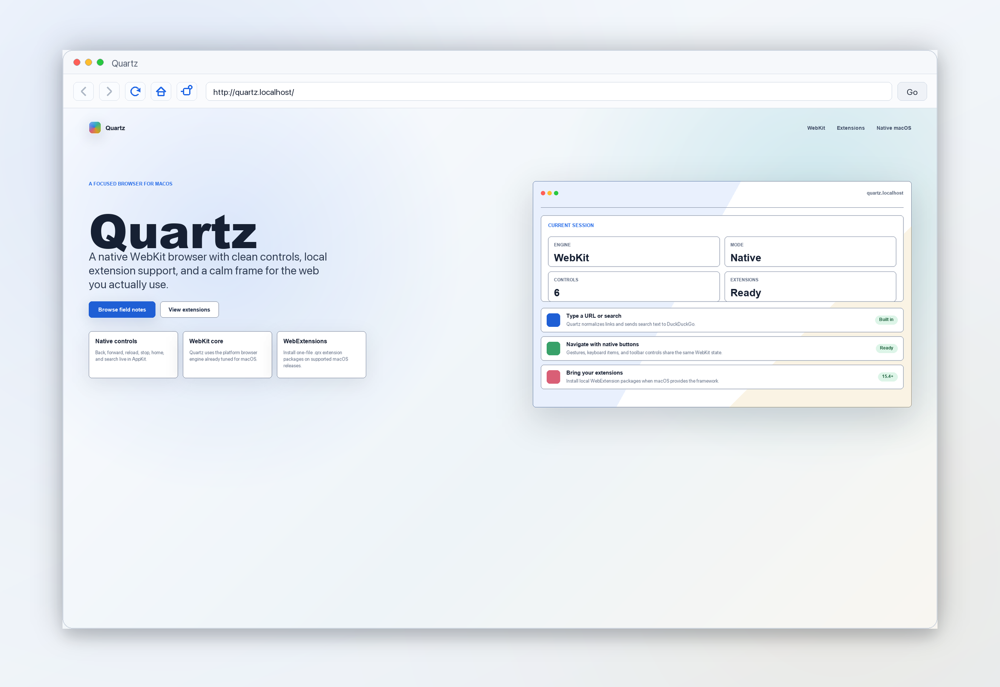
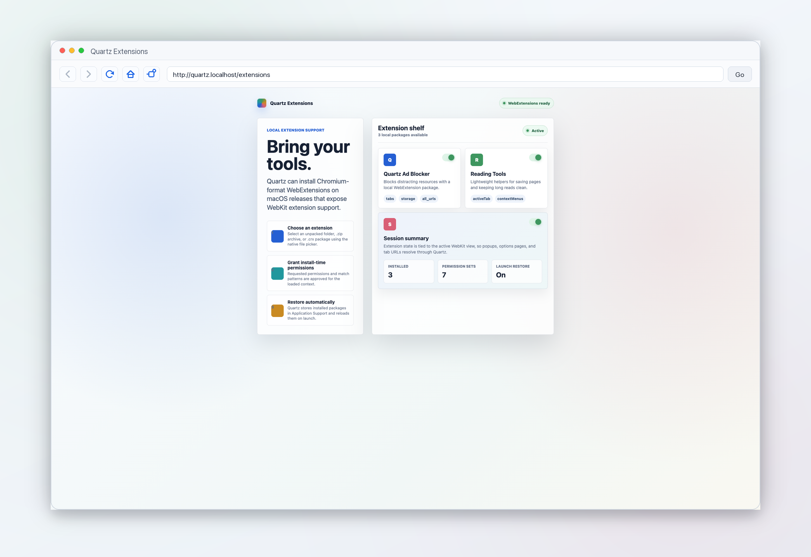

# Quartz

A native macOS web browser.

## Screenshots

<p>
  
</p>

<table>
  <tr>
    <td></td>
    <td></td>
  </tr>
</table>

## Run

```sh
swift run Quartz
```

## Build

```sh
swift build
```

## Features

- WebKit-powered browsing
- Reading mode for article-focused pages
- Optional one-file `.qrx` WebExtension package installation on macOS 15.4+
- Address/search field
- Back, forward, reload, stop, home, and reading controls
- Basic keyboard menu items

## Extensions

Quartz extensions install as a single `.qrx` package. A `.qrx` file is a ZIP archive containing a WebExtension `manifest.json` at its root, saved with the `.qrx` file extension.

Users can opt into extensions with **Extensions > Install .qrx Extension...** and choose a `.qrx` package. Quartz copies installed packages into Application Support and restores them on launch.

The former bundled ad-blocking filters now live in a separate Quartz Ad Blocker extension package.
